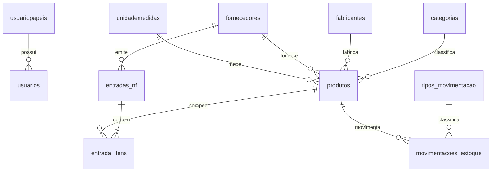

# 🚀 3M3 Partners ERP - Sistema de Gestão de Estoque & Distribuição

[](https://www.php.net/)
[](https://www.mysql.com/)
[](https://getbootstrap.com/)
[](https://en.wikipedia.org/wiki/Model%E2%80%93view%E2%80%93controller)
[](LICENSE)

> **Projeto Enterprise de Engenharia de Software**: Sistema ERP completo voltado para distribuição e logística, projetado com foco em alta performance (PHP Nativo + PDO), arquitetura MVC limpa, controle rigoroso de saldo físico/financeiro e inteligência de negócios (Curva ABC e Ficha Kardex).

---

## 📸 Demonstração do Sistema

| Dashboard Executivo em Tempo Real | Menu & Interface Premium |
| :---: | :---: |
|  |  |

---

## 📌 Sumário
- [Sobre o Projeto](#-sobre-o-projeto)
- [Principais Funcionalidades](#-principais-funcionalidades)
- [Destaques de Engenharia e Arquitetura](#-destaques-de-engenharia-e-arquitetura)
- [Modelagem do Banco de Dados](#-modelagem-do-banco-de-dados)
- [Tecnologias Utilizadas](#-tecnologias-utilizadas)
- [Como Executar o Projeto](#-como-executar-o-projeto)
- [Estrutura do Repositório](#-estrutura-do-repositório)
- [Contato & Autor](#-contato--autor)

---

## 💡 Sobre o Projeto

O **3M3 ERP** foi desenvolvido para resolver problemas críticos enfrentados por distribuidoras e almoxarifados de médio e grande porte, tais como:
1. **Falta de rastreabilidade de mercadorias** em movimentações diárias.
2. **Divergência entre o saldo físico e o sistema** (evitado através de travas estritas de saldo).
3. **Lentidão no processo de entrada de mercadorias** por Nota Fiscal.
4. **Ausência de análise financeira do estoque imobilizado**.

A solução entrega um painel de controle executivo em tempo real e relatórios avançados de inventário que auxiliam na tomada de decisão estratégica de compras e vendas.

---

## ✨ Principais Funcionalidades

### 📊 1. Dashboard Executivo & KPIs
- **Valor em Estoque ($)**: Soma acumulada do valor imobilizado (\(\text{Quantidade} \times \text{Preço de Custo}\)).
- **Indicadores Rápidos**: Produtos ativos, entradas e saídas no mês corrente e alertas automáticos de estoque crítico (abaixo do mínimo).
- **DataView Dinâmico**: Tabela interativa de produtos com saldo positivo.

### 📦 2. Gestão de Estoque & Movimentações
- **Entrada por Nota Fiscal (NFe)**: Lançamento em 2 etapas (Cabeçalho + Itens), recalculando frete, seguro e atualizando o custo e saldo dos produtos automaticamente com transações SQL ACID.
- **Saídas por Requisição / Pedido**: Processamento de baixas com **trava de saldo insuficiente** (impede saldo negativo).
- **Ajustes de Inventário**: Lançamentos manuais de correção de saldo por avaria, perda ou contagem física, com motivo auditável.

### 📈 3. Inteligência de Negócio & Relatórios
- **Ficha Kardex Auditável**: Histórico cronológico exato das movimentações de qualquer produto com cálculo de saldo acumulado.
- **Análise da Curva ABC**: Classificação automatizada de produtos por valor imobilizado:
  - **Classe A**: Representam até 80% do valor do estoque (Alta relevância).
  - **Classe B**: Representam entre 80% e 95% do valor.
  - **Classe C**: Representam os 5% finais do valor.
- **Relatórios Cadastrais**: Listagens analíticas de Clientes, Vendedores, Fornecedores e Produtos.

### 🔐 4. Autenticação & Segurança (RBAC)
- Autenticação com encriptação BCRYPT (`password_verify`).
- Níveis de acesso por papel: **Administrador**, **Gerente**, **Supervisor** e **Operador**.

---

## 🛠️ Destaques de Engenharia e Arquitetura

```
                  +-----------------------------------+
                  |        Navegador Web (Client)     |
                  +-----------------------------------+
                                    |
                               HTTP / HTTPS
                                    v
+-------------------------------------------------------------------+
|                        Web Server (Apache)                        |
|   Public Root: /public/index.php (Roteamento & Autenticação)      |
+-------------------------------------------------------------------+
                                    |
            +-----------------------+-----------------------+
            |                                               |
            v                                               v
+-----------------------+                       +-----------------------+
|  Controllers (Backend)|                       |    Views (Frontend)   |
| /app/controllers/*.php|                       |   /app/views/*.php    |
| - MVC sem frameworks  |                       | - Modern UI Premium   |
| - Regras de Negócio   |                       | - CSS Custom & BS 5   |
+-----------------------+                       +-----------------------+
            |                                               ^
            | (Instancia Models)                            | (Renderiza Dados)
            v                                               |
+-----------------------+                                   |
|     Models (Data)     |                                   |
|   /app/models/*.php   |-----------------------------------+
| - PDO MySQL Prepared  |
+-----------------------+
            |
            v
+-----------------------+
|   MySQL Database      |
|     (bd_3m3erp)       |
+-----------------------+
```

- **Padrão MVC Nativo**: Arquitetura leve e modular sem a sobrecarga de frameworks pesados, garantindo carregamento sub-second (<500ms).
- **Proteção contra SQL Injection**: Uso rigoroso de `PDO::prepare()` com binding de parâmetros em 100% das consultas.
- **Transações ACID no Banco**: Uso de `beginTransaction()`, `commit()` e `rollBack()` na entrada de notas e movimentações de estoque para impedir inconsistência de dados.

---

## 🗄️ Modelagem do Banco de Dados

O banco de dados foi projetado em **MySQL / MariaDB (InnoDB)** com suporte a Foreign Keys estritas e índices otimizados.



---

## 💻 Tecnologias Utilizadas

- **Backend**: PHP 7.4 / 8.x (PDO MySQL)
- **Banco de Dados**: MySQL 5.7+ / MariaDB 10.4+
- **Frontend**: HTML5, CSS3 Customizado (`style_premium.css`), Bootstrap 5.3, FontAwesome 6.0
- **Tipografia**: Google Fonts (Inter)
- **Servidor Web**: Apache 2.4 (XAMPP / Linux LAMP)

---

## 🚀 Como Executar o Projeto

### Pré-requisitos
- Servidor Web (XAMPP, WAMP, LARAGON ou Apache local)
- PHP 7.4 ou superior
- MySQL / MariaDB

### Passo a Passo

1. **Clonar o Repositório**:
   ```bash
   git clone https://github.com/seu-usuario/3m3erp.git
   cd 3m3erp
   ```

2. **Configurar o Banco de Dados**:
   - Abra o `phpMyAdmin` ou seu cliente MySQL de preferência.
   - Crie o banco de dados `bd_3m3erp`.
   - Importe o arquivo de esquema e carga inicial localizado em `database_schema/database.sql`.

3. **Configurar a Conexão**:
   - Edite o arquivo `config/conexao.php` com as credenciais do seu ambiente:
     ```php
     $host     = '127.0.0.1';
     $port     = '3306'; // Ou a porta do seu MySQL
     $dbname   = 'bd_3m3erp';
     $username = 'seu_usuario';
     $password = 'sua_senha';
     ```

4. **Acessar a Aplicação**:
   - Mova a pasta para o diretório `htdocs` ou configure seu VirtualHost.
   - Acesse no navegador: `http://localhost/3m3erp/public/index.php`
   - **Credenciais Padrão de Teste**:
     - **Usuário**: `admin`
     - **Senha**: `admin123`

---

## 📂 Estrutura do Repositório

```
3m3erp/
├── app/
│   ├── controllers/      # Lógica de controle e rotas (MVC)
│   ├── models/           # Mapeamento e consultas PDO
│   └── views/            # Layouts e interfaces da aplicação
├── assets/
│   ├── css/              # Estilos customizados (style_premium.css)
│   └── img/              # Imagens e logotipos
├── config/               # Conexão com banco de dados
├── database_schema/      # Scripts SQL de criação do banco
├── documentation/        # Documentação interna de desenvolvimento
└── public/               # Ponto de entrada publico (index.php)
```

---

## 👨‍💻 Contratar / Contato

Gostou do projeto? Sou especializado em **Engenharia de Software, Arquitetura de Sistemas Web e Engenharia de Prompts**.

- 💼 **LinkedIn**: [Seu LinkedIn](https://linkedin.com/in/seu-perfil)
- ✉️ **E-mail**: seu-email@dominio.com
- 🌐 **Portfólio**: [Seu Site / Portfólio](https://seu-portfolio.com)

---

*Desenvolvido com excelência técnica em Engenharia de Software.*
